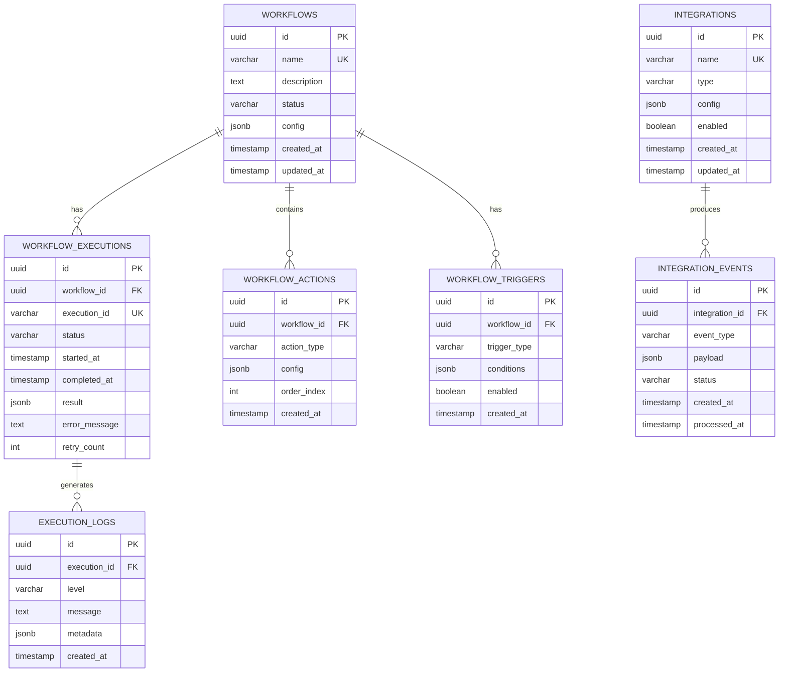

# AutoPR Engine - Database Schema Documentation

## **Overview**

AutoPR Engine uses PostgreSQL 15+ as its primary datastore. This document describes the complete database schema, relationships, indexing strategy, and data flow.

**Version**: 1.0  
**Last Updated**: 2025-01-20  
**Database**: PostgreSQL 15+

---

## **Entity Relationship Diagram**



---

## **Table Definitions**

### **1. workflows**

Stores workflow definitions and configurations.

```sql
CREATE TABLE workflows (
    -- Primary Key
    id UUID PRIMARY KEY DEFAULT gen_random_uuid(),
    
    -- Core Fields
    name VARCHAR(255) NOT NULL UNIQUE,
    description TEXT,
    status VARCHAR(50) NOT NULL DEFAULT 'active',
    
    -- Configuration
    config JSONB NOT NULL DEFAULT '{}',
    
    -- Metadata
    created_at TIMESTAMP WITH TIME ZONE DEFAULT NOW(),
    updated_at TIMESTAMP WITH TIME ZONE DEFAULT NOW(),
    created_by VARCHAR(255),
    
    -- Constraints
    CONSTRAINT chk_workflow_status CHECK (status IN (
        'active', 'inactive', 'archived', 'draft'
    ))
);

-- Indexes
CREATE INDEX idx_workflows_status ON workflows(status);
CREATE INDEX idx_workflows_created_at ON workflows(created_at DESC);
CREATE INDEX idx_workflows_config ON workflows USING GIN(config);

-- Trigger for updated_at
CREATE TRIGGER update_workflows_updated_at
    BEFORE UPDATE ON workflows
    FOR EACH ROW
    EXECUTE FUNCTION update_updated_at_column();
```

**Status Values**:
- `active`: Workflow is enabled and can be executed
- `inactive`: Workflow is disabled temporarily
- `archived`: Workflow is no longer in use
- `draft`: Workflow is under development

**Config JSON Structure**:
```json
{
  "max_concurrent_executions": 5,
  "timeout": 300,
  "retry_policy": {
    "max_attempts": 3,
    "delay": 5
  },
  "notifications": {
    "on_success": ["slack", "email"],
    "on_failure": ["slack", "pagerduty"]
  }
}
```

---

### **2. workflow_executions**

Tracks individual workflow execution instances.

```sql
CREATE TABLE workflow_executions (
    -- Primary Key
    id UUID PRIMARY KEY DEFAULT gen_random_uuid(),
    
    -- Foreign Keys
    workflow_id UUID NOT NULL REFERENCES workflows(id) ON DELETE CASCADE,
    
    -- Identification
    execution_id VARCHAR(255) NOT NULL UNIQUE,
    
    -- Status
    status VARCHAR(50) NOT NULL DEFAULT 'pending',
    
    -- Timing
    started_at TIMESTAMP WITH TIME ZONE DEFAULT NOW(),
    completed_at TIMESTAMP WITH TIME ZONE,
    
    -- Results
    result JSONB,
    error_message TEXT,
    
    -- Retry Information
    retry_count INT DEFAULT 0,
    parent_execution_id UUID REFERENCES workflow_executions(id),
    
    -- Context
    trigger_type VARCHAR(100),
    trigger_data JSONB,
    
    -- Constraints
    CONSTRAINT chk_execution_status CHECK (status IN (
        'pending', 'running', 'completed', 'failed', 'timeout', 'cancelled'
    )),
    CONSTRAINT chk_completed_at_after_started CHECK (
        completed_at IS NULL OR completed_at >= started_at
    )
);

-- Indexes
CREATE INDEX idx_workflow_executions_workflow_id ON workflow_executions(workflow_id);
CREATE INDEX idx_workflow_executions_status ON workflow_executions(status);
CREATE INDEX idx_workflow_executions_started_at ON workflow_executions(started_at DESC);
CREATE INDEX idx_workflow_executions_execution_id ON workflow_executions(execution_id);
CREATE INDEX idx_workflow_executions_trigger_type ON workflow_executions(trigger_type);

-- Composite index for common queries
CREATE INDEX idx_workflow_executions_composite 
    ON workflow_executions(workflow_id, status, started_at DESC);
```

**Status Values**:
- `pending`: Queued for execution
- `running`: Currently executing
- `completed`: Successfully finished
- `failed`: Execution failed
- `timeout`: Exceeded timeout limit
- `cancelled`: Manually cancelled

---

### **3. workflow_actions**

Defines individual actions within workflows.

```sql
CREATE TABLE workflow_actions (
    -- Primary Key
    id UUID PRIMARY KEY DEFAULT gen_random_uuid(),
    
    -- Foreign Keys
    workflow_id UUID NOT NULL REFERENCES workflows(id) ON DELETE CASCADE,
    
    -- Action Definition
    action_type VARCHAR(100) NOT NULL,
    action_name VARCHAR(255) NOT NULL,
    config JSONB NOT NULL DEFAULT '{}',
    
    -- Ordering
    order_index INT NOT NULL,
    
    -- Conditional Execution
    conditions JSONB,
    
    -- Metadata
    created_at TIMESTAMP WITH TIME ZONE DEFAULT NOW(),
    updated_at TIMESTAMP WITH TIME ZONE DEFAULT NOW(),
    
    -- Constraints
    CONSTRAINT uq_workflow_action_order UNIQUE (workflow_id, order_index),
    CONSTRAINT chk_order_index_positive CHECK (order_index >= 0)
);

-- Indexes
CREATE INDEX idx_workflow_actions_workflow_id ON workflow_actions(workflow_id);
CREATE INDEX idx_workflow_actions_type ON workflow_actions(action_type);
CREATE INDEX idx_workflow_actions_order ON workflow_actions(workflow_id, order_index);
```

**Action Types**:
- `platform_detector`
- `pr_review_analyzer`
- `issue_creator`
- `ai_comment_analyzer`
- `quality_gates`
- `post_comment`
- `label_pr`

---

### **4. execution_logs**

Stores detailed logs for workflow executions.

```sql
CREATE TABLE execution_logs (
    -- Primary Key
    id UUID PRIMARY KEY DEFAULT gen_random_uuid(),
    
    -- Foreign Keys
    execution_id UUID NOT NULL REFERENCES workflow_executions(id) ON DELETE CASCADE,
    
    -- Log Details
    level VARCHAR(20) NOT NULL,
    message TEXT NOT NULL,
    metadata JSONB,
    
    -- Context
    action_id UUID REFERENCES workflow_actions(id),
    step_name VARCHAR(255),
    
    -- Timing
    created_at TIMESTAMP WITH TIME ZONE DEFAULT NOW(),
    
    -- Constraints
    CONSTRAINT chk_log_level CHECK (level IN (
        'DEBUG', 'INFO', 'WARNING', 'ERROR', 'CRITICAL'
    ))
);

-- Indexes
CREATE INDEX idx_execution_logs_execution_id ON execution_logs(execution_id);
CREATE INDEX idx_execution_logs_level ON execution_logs(level);
CREATE INDEX idx_execution_logs_created_at ON execution_logs(created_at DESC);

-- Composite index for filtering
CREATE INDEX idx_execution_logs_composite 
    ON execution_logs(execution_id, level, created_at DESC);

-- Partitioning for performance (optional, for high volume)
-- CREATE TABLE execution_logs_2025_01 PARTITION OF execution_logs
--     FOR VALUES FROM ('2025-01-01') TO ('2025-02-01');
```

---

### **5. integrations**

Manages external service integrations.

```sql
CREATE TABLE integrations (
    -- Primary Key
    id UUID PRIMARY KEY DEFAULT gen_random_uuid(),
    
    -- Identification
    name VARCHAR(255) NOT NULL UNIQUE,
    type VARCHAR(100) NOT NULL,
    
    -- Configuration
    config JSONB NOT NULL DEFAULT '{}',
    
    -- Status
    enabled BOOLEAN DEFAULT true,
    health_status VARCHAR(50) DEFAULT 'unknown',
    last_health_check TIMESTAMP WITH TIME ZONE,
    
    -- Credentials (encrypted)
    credentials_encrypted TEXT,
    
    -- Metadata
    created_at TIMESTAMP WITH TIME ZONE DEFAULT NOW(),
    updated_at TIMESTAMP WITH TIME ZONE DEFAULT NOW(),
    
    -- Constraints
    CONSTRAINT chk_integration_type CHECK (type IN (
        'github', 'linear', 'slack', 'axolo', 'teams', 'discord', 
        'jira', 'sentry', 'datadog'
    )),
    CONSTRAINT chk_health_status CHECK (health_status IN (
        'healthy', 'degraded', 'unhealthy', 'unknown'
    ))
);

-- Indexes
CREATE INDEX idx_integrations_type ON integrations(type);
CREATE INDEX idx_integrations_enabled ON integrations(enabled);
CREATE INDEX idx_integrations_health ON integrations(health_status);
```

**Integration Types**:
- `github`: GitHub API integration
- `linear`: Linear project management
- `slack`: Slack notifications
- `axolo`: Axolo PR collaboration
- `teams`: Microsoft Teams
- `discord`: Discord notifications
- `jira`: Jira issue tracking
- `sentry`: Error monitoring
- `datadog`: APM and metrics

---

### **6. integration_events**

Tracks events from integrated services.

```sql
CREATE TABLE integration_events (
    -- Primary Key
    id UUID PRIMARY KEY DEFAULT gen_random_uuid(),
    
    -- Foreign Keys
    integration_id UUID NOT NULL REFERENCES integrations(id) ON DELETE CASCADE,
    
    -- Event Details
    event_type VARCHAR(100) NOT NULL,
    event_id VARCHAR(255),
    payload JSONB NOT NULL,
    
    -- Processing Status
    status VARCHAR(50) DEFAULT 'pending',
    processed_at TIMESTAMP WITH TIME ZONE,
    error_message TEXT,
    retry_count INT DEFAULT 0,
    
    -- Timing
    created_at TIMESTAMP WITH TIME ZONE DEFAULT NOW(),
    
    -- Constraints
    CONSTRAINT chk_event_status CHECK (status IN (
        'pending', 'processing', 'completed', 'failed', 'ignored'
    ))
);

-- Indexes
CREATE INDEX idx_integration_events_integration_id ON integration_events(integration_id);
CREATE INDEX idx_integration_events_status ON integration_events(status);
CREATE INDEX idx_integration_events_type ON integration_events(event_type);
CREATE INDEX idx_integration_events_created_at ON integration_events(created_at DESC);

-- Composite index for processing queue
CREATE INDEX idx_integration_events_queue 
    ON integration_events(status, created_at) 
    WHERE status IN ('pending', 'processing');
```

**Event Types** (GitHub):
- `pull_request.opened`
- `pull_request.synchronize`
- `pull_request.closed`
- `issues.opened`
- `push`
- `release.published`

---

### **7. workflow_triggers**

Defines trigger conditions for workflows.

```sql
CREATE TABLE workflow_triggers (
    -- Primary Key
    id UUID PRIMARY KEY DEFAULT gen_random_uuid(),
    
    -- Foreign Keys
    workflow_id UUID NOT NULL REFERENCES workflows(id) ON DELETE CASCADE,
    
    -- Trigger Definition
    trigger_type VARCHAR(100) NOT NULL,
    conditions JSONB NOT NULL DEFAULT '{}',
    
    -- Status
    enabled BOOLEAN DEFAULT true,
    
    -- Metadata
    created_at TIMESTAMP WITH TIME ZONE DEFAULT NOW(),
    updated_at TIMESTAMP WITH TIME ZONE DEFAULT NOW(),
    
    -- Constraints
    CONSTRAINT chk_trigger_type CHECK (trigger_type IN (
        'event', 'schedule', 'webhook', 'manual'
    ))
);

-- Indexes
CREATE INDEX idx_workflow_triggers_workflow_id ON workflow_triggers(workflow_id);
CREATE INDEX idx_workflow_triggers_type ON workflow_triggers(trigger_type);
CREATE INDEX idx_workflow_triggers_enabled ON workflow_triggers(enabled);
```

**Trigger Types**:
- `event`: Triggered by integration events
- `schedule`: Cron-based scheduled execution
- `webhook`: External webhook triggers
- `manual`: User-initiated execution

---

## **Supporting Objects**

### **Functions**

#### **update_updated_at_column()**

```sql
CREATE OR REPLACE FUNCTION update_updated_at_column()
RETURNS TRIGGER AS $$
BEGIN
    NEW.updated_at = NOW();
    RETURN NEW;
END;
$$ LANGUAGE plpgsql;
```

#### **cleanup_old_execution_logs()**

```sql
CREATE OR REPLACE FUNCTION cleanup_old_execution_logs(days_to_keep INT DEFAULT 30)
RETURNS INT AS $$
DECLARE
    deleted_count INT;
BEGIN
    DELETE FROM execution_logs
    WHERE created_at < NOW() - (days_to_keep || ' days')::INTERVAL;
    
    GET DIAGNOSTICS deleted_count = ROW_COUNT;
    RETURN deleted_count;
END;
$$ LANGUAGE plpgsql;
```

### **Views**

#### **recent_workflow_activity**

```sql
CREATE VIEW recent_workflow_activity AS
SELECT 
    w.name AS workflow_name,
    we.execution_id,
    we.status,
    we.started_at,
    we.completed_at,
    EXTRACT(EPOCH FROM (we.completed_at - we.started_at)) AS duration_seconds,
    we.retry_count,
    we.trigger_type
FROM workflow_executions we
JOIN workflows w ON we.workflow_id = w.id
WHERE we.started_at > NOW() - INTERVAL '7 days'
ORDER BY we.started_at DESC;
```

#### **workflow_performance_stats**

```sql
CREATE VIEW workflow_performance_stats AS
SELECT 
    w.id AS workflow_id,
    w.name AS workflow_name,
    COUNT(*) AS total_executions,
    COUNT(*) FILTER (WHERE we.status = 'completed') AS successful_executions,
    COUNT(*) FILTER (WHERE we.status = 'failed') AS failed_executions,
    ROUND(AVG(EXTRACT(EPOCH FROM (we.completed_at - we.started_at))), 2) AS avg_duration_seconds,
    MAX(we.started_at) AS last_execution_at
FROM workflows w
LEFT JOIN workflow_executions we ON w.id = we.workflow_id
WHERE we.started_at > NOW() - INTERVAL '30 days'
GROUP BY w.id, w.name;
```

---

## **Data Retention Policies**

### **Automatic Cleanup**

```sql
-- Create scheduled cleanup job (using pg_cron extension)
SELECT cron.schedule(
    'cleanup-old-logs',
    '0 2 * * *', -- Daily at 2 AM
    $$SELECT cleanup_old_execution_logs(30)$$
);

-- Cleanup completed executions older than 90 days
SELECT cron.schedule(
    'cleanup-old-executions',
    '0 3 * * 0', -- Weekly on Sunday at 3 AM
    $$
    DELETE FROM workflow_executions 
    WHERE status IN ('completed', 'failed', 'timeout') 
    AND completed_at < NOW() - INTERVAL '90 days'
    $$
);
```

---

## **Performance Optimization**

### **Query Optimization Tips**

1. **Always use indexes for filtering**:
```sql
-- Good
SELECT * FROM workflow_executions 
WHERE workflow_id = 'xxx' AND status = 'running';

-- Bad (full table scan)
SELECT * FROM workflow_executions 
WHERE LOWER(status) = 'running';
```

2. **Use appropriate JSONB operators**:
```sql
-- Good (uses GIN index)
SELECT * FROM workflows 
WHERE config @> '{"enabled": true}';

-- Bad (cannot use index efficiently)
SELECT * FROM workflows 
WHERE config->>'enabled' = 'true';
```

3. **Limit result sets**:
```sql
-- Always use LIMIT for large tables
SELECT * FROM execution_logs 
ORDER BY created_at DESC 
LIMIT 100;
```

### **Connection Pooling**

Recommended settings in `autopr/config/settings.py`:

```python
database:
  pool_size: 20          # Base connections
  max_overflow: 40       # Additional connections under load
  pool_timeout: 30       # Wait time for connection
  pool_recycle: 3600     # Recycle connections every hour
```

---

## **Backup Strategy**

### **Daily Backups**

```bash
# Full backup
pg_dump -h $DB_HOST -U $DB_USER -Fc autopr > autopr_$(date +%Y%m%d).dump

# Incremental backup (using pg_basebackup)
pg_basebackup -h $DB_HOST -U $DB_USER -D /backups/base -Fp -Xs -P
```

### **Point-in-Time Recovery**

Enable WAL archiving in `postgresql.conf`:

```conf
wal_level = replica
archive_mode = on
archive_command = 'cp %p /var/lib/postgresql/wal_archive/%f'
```

---

## **Migration Guide**

### **Using Alembic**

```bash
# Initialize Alembic (already done)
poetry run alembic init alembic

# Create migration
poetry run alembic revision --autogenerate -m "Add new column"

# Apply migration
poetry run alembic upgrade head

# Rollback
poetry run alembic downgrade -1
```

---

## **Security Considerations**

### **Row-Level Security (RLS)**

```sql
-- Enable RLS on sensitive tables
ALTER TABLE integrations ENABLE ROW LEVEL SECURITY;

-- Create policy
CREATE POLICY integration_access_policy ON integrations
    USING (created_by = current_user);
```

### **Encryption**

- **At Rest**: Enable PostgreSQL encryption or use cloud provider encryption
- **In Transit**: Always use SSL/TLS connections
- **Credentials**: Store encrypted in `credentials_encrypted` field

---

## **Monitoring Queries**

### **Active Executions**

```sql
SELECT 
    w.name,
    we.execution_id,
    we.status,
    NOW() - we.started_at AS running_time
FROM workflow_executions we
JOIN workflows w ON we.workflow_id = w.id
WHERE we.status = 'running'
ORDER BY we.started_at;
```

### **Failed Executions (Last 24h)**

```sql
SELECT 
    w.name,
    COUNT(*) AS failure_count,
    array_agg(DISTINCT we.error_message) AS error_messages
FROM workflow_executions we
JOIN workflows w ON we.workflow_id = w.id
WHERE we.status = 'failed'
AND we.started_at > NOW() - INTERVAL '24 hours'
GROUP BY w.name
ORDER BY failure_count DESC;
```

### **Database Size**

```sql
SELECT 
    pg_size_pretty(pg_database_size('autopr')) AS database_size,
    pg_size_pretty(pg_total_relation_size('workflow_executions')) AS executions_size,
    pg_size_pretty(pg_total_relation_size('execution_logs')) AS logs_size;
```

---

## **TODO: Production Enhancements**

- [ ] Implement table partitioning for `execution_logs` by month
- [ ] Add full-text search on log messages
- [ ] Create materialized views for analytics
- [ ] Implement audit logging table
- [ ] Add database replication for high availability
- [ ] Set up automated performance monitoring
- [ ] Create database maintenance scripts
- [ ] Implement data archival strategy

---

**Document Version**: 1.0  
**Last Updated**: 2025-01-20  
**Next Review**: 2025-04-20
